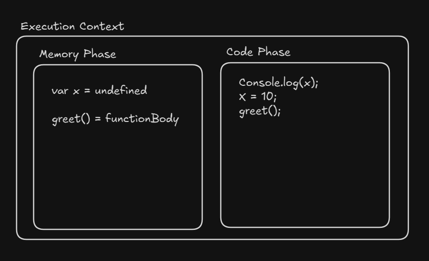

# Execution Context

An Execution Context is the environment in which JavaScript code is executed.

It tells JavaScript:

- Which variables exist
- Which functions exist
- What this refers to

## Execution Context Contains

Each execution context has two phases:

### 1. Memory Creation Phase

- Variables are stored in memory
- Functions → full definition
- this is set

### 2. Execution Phase

- Code runs line by line
- Values are assigned
- Functions are executed

<br>



## Types

### a) Global Execution Context (GEC)

GEC (Global Execution Context) is the default execution context created by JavaScript when the program starts running.

- Created before any code is executed
- Only one GEC exists in a program
- It handles all global code

Example :

```js
var a = 10;

function test() {
  console.log(a);
}

test();

// a and test are part of the GEC
// Calling test() creates a Function Execution Context
```

### b) Function Execution Context (FEC)

A Function Execution Context (FEC) is the execution environment created by JavaScript every time a function is called.

- Created when a function is invoked
- Each function call creates a new FEC
- Exists only while the function is executing

Example :

```js
function add(a, b) {
  var sum = a + b;
  return sum;
}

add(2, 3);

// Flow:

// add() is called
// FEC for add is created
// Code inside add executes
// FEC is removed after return
```

### c) Eval Execution Context (Rarely Used)

An Eval Execution Context is a special execution context created by JavaScript when the `eval()` function is used.

<b>What is eval()?</b><br>
eval() takes a string of JavaScript code and executes it as real JavaScript.

Example :

```js
eval("var x = 10; console.log(x);");
```

<hr>
