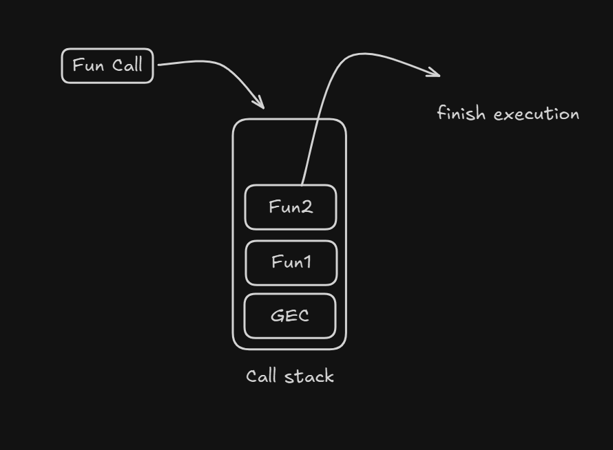

# Asynchronous JS

JavaScript is single-threaded, meaning it executes one task at a time.

Asynchronous JS allows long-running tasks to run in the background without blocking the main thread.

### Why needed ?

API call, Database queries, file reading, and timer take time to execute. Without async UI will freezes. So async js is needed.


## Synchronous vs Asynchronous

### 1. Synchronous (Blocking)

By default, JavaScript executes code line-by-line. If one line takes a long time to finish (like a massive loop), the lines below it are "blocked" and cannot run.

```js
console.log("Start");
console.log("Middle");
console.log("End");

// Output : 
// Start
// Middle
// End
```
Each line waits for the previous one.

### 2. Asynchronous (Non-Blocking)

Asynchronous code allows JavaScript to start a long-running task and then move on to the next line of code immediately. When the task finishes, JavaScript comes back to handle the result.

```js
console.log("Start");

setTimeout(() => {
  console.log("Async Task");
}, 1000);

console.log("End");

// Output :
// Start
// End
// Async Task
```

Here setTimeeout take time to finish so it execution started and move to next line of code when setTimeout completed its exection JS engine come back and execute it.

 <hr>

 ## JavaScript Runtime Architecture Components

 ### 1. Callbacks :

 A callback is a function passed into another function as an argument, which is then "called back" (executed) at a later time.

 Example : 

 ```js
 function greet(name, callback) {
  console.log("Hello " + name);
  callback();
}

greet("Alice", () => {
  console.log("The callback was executed!");
});
```


### 2. Call Stack : 

It is a mechanism that keeps track of the function calls in program 

It follow LIFO principle

<b>The Step-by-Step Process : </b>

- When the script starts, it enters the Global Execution Context (the base of the stack).
- When a function is called, a new frame is created and added to the top.
- If that function calls another function, that new one goes on top.
- Once a function returns a value, it is removed, and the engine resumes where it left off in the function below it.
<br>
<br>



### 3. Promises :

Promise is an object representing the eventual completion or failure of an asynchronous task.

Before Promises, we used callbacks, which led to the "Pyramid of Doom." Promises provide a much cleaner, more structured way to handle async code.

### Promise States

There are three states of promise

- Pending : Initial state. Operation hasn't finished yet
- Fulfilled (Resolved) : The operation completed successfully.
- Rejcted : The operation failed

### Creating a Promise

You create a promise using the `new Promise` constructor. It takes a function (executor) with two arguments: resolve and reject.

Example : 

```js
const myPromise = new Promise((resolve, reject) => {
    const success = true;

    setTimeout(() => {
        if (success) {
            resolve("Data received! ✅");
        } else {
            reject("Error: Connection failed! ❌");
        }
    }, 2000);
});
```


### Consuming Promise

Once a promise is created, you need to "listen" for the result. You do this using .then(), .catch(), and .finally().

- `.then()`: Runs when the promise is fulfilled.
- `.catch()`: Runs when the promise is rejected.
- `.finally()`: Runs no matter what (clean-up code).

Example : 

```js
myPromise
    .then((data) => {
        console.log(data); // "Data received! ✅"
    })
    .catch((error) => {
        console.error(error); // "Error: Connection failed! ❌"
    })
    .finally(() => {
        console.log("Operation finished.");
    });
```


<b> JavaScript provides several methods to handle groups of promises : </b>

<b>a) Promise.all([...]) </b> — "The All-or-Nothing"

Waits for all to succeed. If one fails, the whole thing fails.

This is best used when you need multiple pieces of data that depend on each other (e.g., fetching a user's profile and their settings before rendering the page).

- Success: Returns an array of results only after all promises resolve.

- Failure: Rejects immediately if any single promise fails.

Example : 

```js
const fetchUser = new Promise(res => setTimeout(() => res({id: 1, name: "Alice"}), 1000));
const fetchPosts = new Promise(res => setTimeout(() => res(["Post A", "Post B"]), 1500));
const fetchSettings = new Promise(res => setTimeout(() => res({theme: "dark"}), 500));

Promise.all([fetchUser, fetchPosts, fetchSettings])
  .then((results) => {
    const [user, posts, settings] = results;
    console.log("All data ready:", user, posts, settings);
  })
  .catch((err) => {
    console.error("One of the fetches failed!", err);
  });
```

Here if any one promise fails, you get nothing back from the other two, even if they were successful.


<b>b) Promise.allSettled([...]) </b> — "The Completionist"

Waits for all to finish, regardless of success or failure.

Use this when you want to know the outcome of every request, regardless of whether they succeeded or failed (e.g., a bulk upload where you want to show which files worked and which didn't).

Example :

```js
const email1 = Promise.resolve("Sent to Alice");
const email2 = Promise.reject("Invalid Email: Bob");
const email3 = Promise.resolve("Sent to Charlie");

Promise.allSettled([email1, email2, email3])
  .then((results) => {
    results.forEach((result, index) => {
      if (result.status === "fulfilled") {
        console.log(`Success: ${result.value}`);
      } else {
        console.log(`Failed: ${result.reason}`);
      }
    });
  });
```

<b>c) Promise.any([...]) </b> 

Returns the first successful promise. Ignores rejections unless all fail.

Scenario: You have 3 different "Mirror Servers" (Server A, B, and C) that all have the same file. You don't care which one you use; you just want the first one that works.

Example :

```js
const serverA = new Promise((_, reject) => setTimeout(() => reject("A failed"), 100));
const serverB = new Promise(res => setTimeout(() => res("Data from Server B"), 500));
const serverC = new Promise(res => setTimeout(() => res("Data from Server C"), 200));

Promise.any([serverA, serverB, serverC])
  .then(firstSuccess => {
    console.log(firstSuccess); // "Data from Server C" (C was faster than B, and A failed)
  })
  .catch(err => {
    console.log("All servers failed:", err.errors);
  });
```


### 4. async / await :

async/await is syntatic suger to over promises.

It is a special syntax that allows you to write asynchronous code (Promises) that looks and behaves like synchronous code.

- `async` : Used to define a function that will contain asynchronous operations. An async function always returns a promise automatically.

    Example :

    ```js
    async function  greet(){
        return "hello"
    }

    greet().then((msg) => console.log(msg));
    ```
    An async function always returns a Promise<br>
    return "hello" is automatically wrapped as
    ```
    return Promise.resolve("hello");
    ```
    So greet() returns a Promise

    .then() receives the resolved value ("hello")


- `await` : Can only be used inside an async function. it pauses the execution of the function until the Promise is resolved or rejected. <b>Only pauses the execution of async function, not entire JS engine or main thread. </b>

    Example :

    ```js
    async function fetchData(){
        let res = await fetch("http://demodata");
        let data = await res.json();

        console.log(data);
    }
    ```