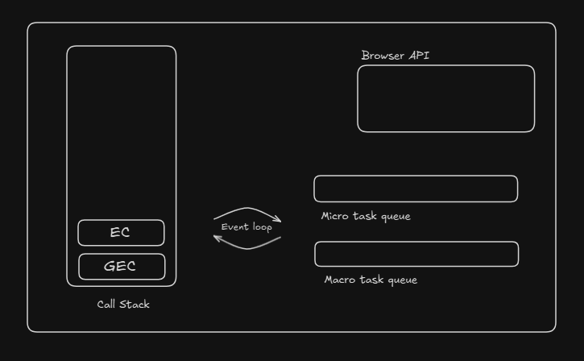
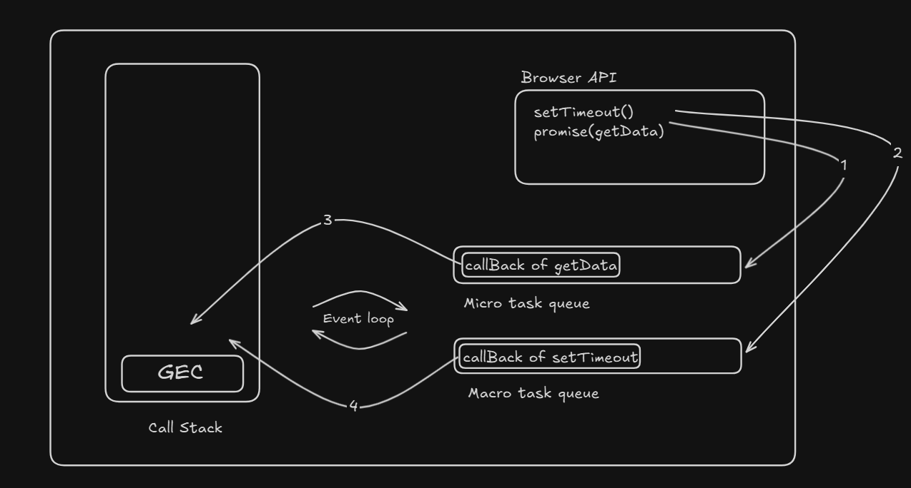

# JavaScript Internal Working

Every browser has an engine that executes JS code. Chrome and Node.js use V8, while Firefox uses SpiderMonkey.

JavaScript use JIT (Just-In-Time) compiler. It compile JS code into machine code at runtime, instead of beforehand.


## The Runtime Environment

JavaScript is single-threaded, meaning it can only do one thing at a time. However, we can perform "asynchronous" tasks (like fetching data) without freezing the UI. This is possible because of the JavaScript Runtime Environment.

### Key Components:

### 1. Call Stack : 

The Call Stack is a data structure used by the JavaScript engine to keep track of function calls and manage the execution order of synchronous code.

It follows the LIFO principle (Last In, First Out).

### 2. Web APIs (Browser APIs) : 

Web APIs are browser-provided interfaces that allow JavaScript to access asynchronous features like timers, network requests, DOM events, and browser storage.

JavaScript is single-threaded,cannot handle long-running tasks on the call stack

So browsers provide Web APIs to run async tasks outside the call stack and prevent UI blocking.

### 3. Task Queues (Queues of Callbacks) :

Task Queues are data structures in the JavaScript runtime that store callback functions of asynchronous operations waiting to be executed on the Call Stack.

They help JavaScript handle non-blocking async behavior.

<b>Types of Task Queues : </b>

a) Microtask Queue (High Priority) : 

Stores callbacks from:

- Promise.then()
- catch()
- finally()
- queueMicrotask()

Executed immediately after the call stack is empty

Runs before macrotasks

b) Macrotask Queue (Callback Queue) : 

Stores callbacks from:

- setTimeout
- setInterval
- DOM events
- MessageChannel

Executed after microtasks


### How Task Queues Work Together

- Async task finishes in Web API
- Callback placed in appropriate queue
- Event Loop checks:
    - Is Call Stack empty?
- Executes:
    - All microtasks
    - Then one macrotas


Example :

```js
console.log("Start");

setTimeout(() => console.log("Timeout"), 0);

Promise.resolve().then(() => console.log("Promise"));

console.log("End");

// Output : 
// Start
// End
// Promise
// Timeout
```


### 4. Event Loop

The Event Loop is a mechanism in the JavaScript runtime that continuously checks the Call Stack and Task Queues and decides when and what asynchronous code should be executed next.

<b>The event loop monitors the call stack and task queues and pushes callbacks to the call stack when it is empty.</b>

It enables JavaScript to be non-blocking despite being single-threaded.


<b>What Does the Event Loop Do?</b>

- Checks if the Call Stack is empty
- Executes all Microtasks
- Executes one Macrotask
- Repeats this cycle continuously


<b>Why Event Loop is Needed?</b>

- JavaScript has only one call stack
- Async operations must not block execution
- Event loop coordinates async callbacks safel

<hr>

## Working Flow

- When asynchronous function like `setTimeout()`, `fetch()`, `setInterval()` etc are called then they are handed off to browser API (run's in background).

- Once an asynchronous task is completed, the callback function associated with it is pushed to the appropriate task queue (Micro task queue or Macro task queue).

- The event loop continuously checks whether the call stack is empty. As soon as it finds the call stack empty, it pushes a callback from one of the task queues (according to priority) into the call stack for execution.

<br>



<hr>


## Example 

```js
async function getData(){
    return "data";
}

console.log("A");

setTimeout(() => console.log("B"), 0);

getData.then(() => console.log("get data done")); // promise

console.log("C");
```

### Execution flowing explanation : 

<b>Step 1: Global Execution Context Creation </b>

- When this JS file is loaded, the JavaScript engine creates a Global Execution Context (GEC). Memory is allocated for global variables and functions. The console object, setTimeout function, and getData promise reference are available in memory.

<b>Step 2: Execution Phase Begins</b>


The engine starts executing the code line by line.

- Line 1: `console.log("A");`
    - The console.log executes, printing: A
    - Once finished, console.log is popped from the Call Stack.

- Line 2: `setTimeout(() => console.log("B"), 0);`

    - The `setTimeout` function is called. This is asynchronous.
    - The callback `() => console.log("B")` is sent to the browser’s Web API with a timer of 0ms
    - Important: It does not go on the Call Stack yet. The engine moves to the next line.
    - After the timer expires, the callback will be placed into the Macrotask Queue.

- Line 3: `getData.then(() => console.log("get data done"));`

    - `getData` is a Promise.
    - `.then` is asynchronous. Once the promise is resolved, the callback `() => console.log("get data done")` is added to the Microtask Queue.

- Line 4: `console.log("C");`

    - console.log("C") is a synchronous function call, so it is pushed onto the Call Stack. And print C.


<b>Step 3: Call Stack is Empty → Event Loop Takes Over</b>

Once the synchronous code finishes, the Call Stack is empty. Now the Event Loop checks the queues.

- Step 3a: Microtasks Queue

    - The Event Loop first checks the Microtask Queue.
    - `getData.then(...)` is in the microtask queue, so its callback is pushed onto the Call Stack and executed.

- Step 3b: Macrotasks Queue

    - Now the Event Loop moves to the Macrotask Queue.
    - The `setTimeout` callback is in the macrotask queue.
    - Its callback `() => console.log("B")` is pushed onto the Call Stack and executed.


<b>Step 4: Execution Complete</b>

At this point:
- Call Stack is empty
- Microtask Queue is empty
- Macrotask Queue is empty

The JavaScript engine has finished executing all synchronous and asynchronous code for this snippet.
 

<b>Step 5: Final Output</b>

```css
A
C
get data done
B
```


