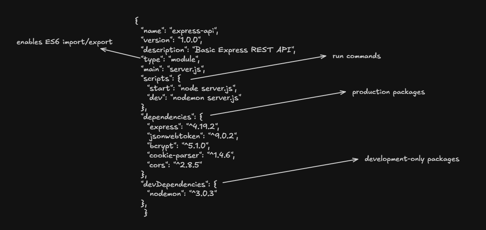

# Package Manager

A package manager is a tool that helps developers install, update, remove, and manage software libraries (packages) and their dependencies automatically.

## npm 

- Node package manager is the default package manager for the JS runtime enviroment Node.js

- `npm` always installs packages either locally (node-modules) or globally.

- node-modules is location where `npm` installs all the dependencies your project needs to run

## npx

- Node package execute

- It is used to run packages without installing them. It execute CLI tools directly.

- It run one-time commands

    Example :

    ```
    npx create-react-app myApp
    ```

    Here, create-react-app is not installed in your system. It is only executed.

    npx download it -> run it -> delete it

    ### Why npx exists

    - Before npxm, if you wanted to run a CLI tool like `craete-react-app` you had to insatll it globally.

    - This can cause problems like 
        
        - Too many global installs
        - Version conflicts
        - Hard to manage updates

    npx solve this all


## Note :

- npm -> install packages
- npx -> executes packages

## package.json

`package.json` is the configuration and metadata file for a Node.js project.

It tells npm (or other package managers) how the project is structured, which dependencies it needs, and how it should be run.

It contains
    
- Project metadata
- Scripts (Ex. run script, test script)
- Dependencies
- Entry point

<br>




## package-lock.json

`package-lock.json` is an auto-generated file created by npm that locks the exact versions of all installed dependencies (including nested dependencies).

It's job is to lock the dependency versions. It stores exact version of every package installed.

- Ensures same dependency tree across all environments
- Makes installs faster and deterministic
- Makes installs faster and deterministic


## Difference: package.json vs package-lock.json

| package.json             | package-lock.json               |
| ------------------------ | ------------------------------- |
| Defines allowed versions | Stores exact installed versions |
| Written by developer     | Auto-generated by npm           |
| Uses ranges (`^`, `~`)   | Uses fixed versions             |
| Needed to install        | Needed for consistency          |
