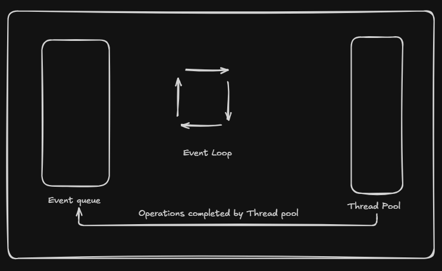
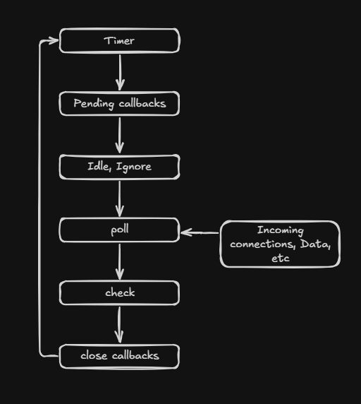

# Single Threaded architecure in node js

Node.js has a single-threaded model. This means it uses a single thread to handle multiple tasks. To achieve this, Node.js uses an event-driven, non-blocking I/O model.

## The Event-driven and non blocking I/O model 

The core of Node.js's single-threaded architecture is the event loop. The event loop continuously cycles through a series of phases, executing callbacks and handling events. 

- <b> Event Queue : </b>

    Incoming requests are placed in event queue. There are multiple queues. They are conceptually grouped and known as macro task queues.

- <b> Event loop :  </b>

    Picks up the request from the queue and processes them.

- <b> Callbacks : </b>

    For each request,node js executes the associated the callback function, if the call back function involves a blocking operation like file systems, crypto, dns lookup, it delegates them to the thread pool.

- <b> Thread pool : </b>

    Node js uses a thread pool which is amnaged by the libuv library to handle the non blocking operations, once completed, the results are placed back into the evemt queue for event loop to process it.

## Priority of macro task queue : 

1. Timers Queue - setTimeout
2. Pending Callbacks Queue 
3. Poll Queue - file system callbacks, network I/O callbacks, incoming http requests
4. Check Queue - setImmediate
5. Close Callbacks Queue - socket close

- After every macro phase, Node.js executes process.nextTick queue and Promise microtask queue

### Event Loop diagram :

### Event Loop Phases :

<b>a) Timer phase : </b>

- Executes callbacks scheduled by `setTimerOut()` and `setInterval()`

<b>b) Pending callbacks phase : </b>

- Executes callbacks for certain system operations, like deferred I/O callbacks

<b>c) Idle phase : </b>

- useed internally by node.js

<b>d) Poll phase : </b>

- Retrieve and execute new I/O events.

<b>e) Check phase : </b>

- Executes callbacks scheduled by `setImmediate()`

<b>f) Close callbacks phase : </b>

- Executes callbacks associated with the closing of resources

- Example :
    -`socket.on('close')`

 
 
 

