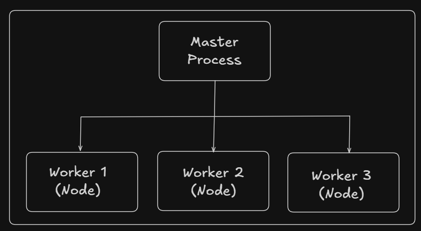

# Cluster

Cluster is a Node.js module that allows you to run multiple Node.js processes to fully utilize multi-core CPUs, mainly for handling more HTTP requests.

Clustering lets Node.js scale horizontally on a single machine

Clustering Creates multiple Node.js processes

Each process:

- Has its own event loop
- Has its own memory

All processes Listen on the same port and are managed by a master (primary) process.

 

Each worker can handle requests in parallel

## Difference between Worker Threads and Cluster in Node.js :

Both are used to improve performance, but they solve different problems.

Core Difference (Simple)

- Worker Threads = parallel computation
- Cluster = parallel request handling

| Feature       | Worker Threads                  | Cluster                 |
| ------------- | ------------------------------- | ----------------------- |
| Type          | Multiple threads                | Multiple processes      |
| Use case      | CPU-intensive tasks             | Scaling HTTP servers    |
| Memory        | Shared (optional)               | Separate memory         |
| Event Loop    | One per thread                  | One per process         |
| Communication | Message passing / shared memory | IPC (process messaging) |
| Startup cost  | Low                             | High                    |
| Crash impact  | Isolated                        | Process restart needed  |
| Access        | Full Node APIs                  | Full Node APIs          |
