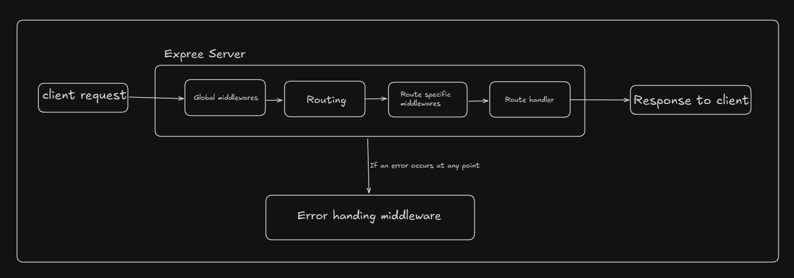

# Express.js

Express is a minimal and flexible Node.js
web application <b>framework</b> that provides a robust set of features for building web servers.

It is a layer built on top of Node.js’s web server functionality, simplifying its APIs and adding helpful new features.

- It avoide repetitive code.
- Easy routing.
- Built-in middleware system.
- Easy to integrate auth, security and validation.

It is primarily a routing and middleware framwork designed to handle HTTP requests and response efficiently.

<hr>

## Express architecture

Express itself doesn't enforce a strict architectur pattern (like MVC), but it's structure centers arrount the following key components :

### 1. The application object (app) : 

The core object created when you initialize Express. It represents the entire application. 

It's used for routing, middleware and settings.

### 2. Routing :

Routing defines how an application responds to client requests at a particular endpoint and with a specific HTTP method.

Example :

```js
app.get('/users' , (req, res)=>{
    res.send(data);
});
```

### 3. Middleware :

Middleware functions are special function that have access to request object, response object and next middleware function in the applications request-response cycle.

Middleware function can perform any of the following task :
- Execute and code.
- Make chnages to req and res objects.
- End the request-response cycle.
- Call the next middleware function in stack.
<hr>


## Express work flow (Request - Response cycle)

### Step 1. Incoming request :
- A client sends an HTTP request to the Express server. This request includes a method and URL path.

### Step 2. Request enter the middleware stack :
- The request first passes through global application level middlewares defined by `app.use()`.

### Step 3. Routing layer match :
- The seerver's routing mechanism checks the request method and path agains the define routes. If a match is found the request is directed to the handler associated with that route.

### Step 4. Route specific middlewares execution :
- If route has it's own chain of middleware functions, the request passes through these middlewares before hitting the final route.

### Step 5. Final route handler ;
- Request reaches the final route handler function. This function contains the core logic. It ultiately sends a response back to the client.

### Step 6. Error handling middleware (If error occure) :

- If error occure at any point in th req-res cycle, it is passed to a special error handling middleware. This middleware formate the error and send an appropriate response to the client.




<hr>

## Express server creation

```js
import express from 'express'

const app = express();

app.get("/", ()=>{
    res.send("Hello from server");
});

app.listen(3000 , () => {
    console.log("Server running on port 3000");
});
```