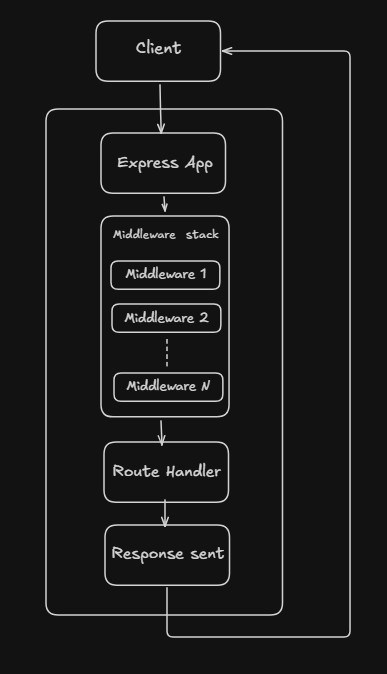

# Request-Response Cycle

The request–response cycle in Express.js describes what happens from the moment a client sends an HTTP request until the server sends back a response.

## Work Flow

### Step 1. Client sends a request
    
- A client (browser, Postman, frontend app) sends an HTTP request to the server.

    Example:
    ```
    GET /users
    POST /login
    ```

- This request contains: Method (GET, POST, PUT, DELETE), URL, Headers, Body (for POST/PUT)

### Step 2. Express receives the request

- Express internally uses Node.js HTTP server.
- When a request arrives, Express creates two objects :
    - `req` → request object
    - `res` → response object


### Step 3. Middleware execution (top to bottom)

- Express processes requests in order, middleware by middleware.
- Middleware can : 

    - Read/modify req and res
    - End the response
    - Pass control to next middleware using `next()`


### Step 4. Route matching

- Express checks if any route matches:

    - HTTP method
    - URL path

- If matched → route handler runs
- If not → moves to next middleware

### Step 5. Route handler (Controller logic)

- This is where business logic runs.

- Here you can:

    - Access data from req
    - Query database
    - Process data

### Step 6. Sending the response

- Response is sent using `res` methods:

    Example : 

    ```js
    res.send()
    res.json()
    res.status(200).send()
    res.redirect()
    res.render()
    ```

### Step 7. Error handling (if something goes wrong)

- Errors can occur in:

    - Middleware
    - Routes
    - Async code

- We can handle this errors using error handler middleware.

- Error middleware:

    - Has 4 parameters
    - Must be defined at the end

<hr>

### Note : Only ONE response per request. Once response is sent,  Request–response cycle ends




<hr>

## `req` and `res` Object

In Express, req (request) and res (response) are objects created by Express on top of Node.js’s native HTTP objects.

### The `req` object contains all information sent by the client.

- `req.param` → URL parameters

    ```js
    // /users/10   -> /user/:id

    req.params.id  // "10"
    ```

- `req.query` → Query string parameters

    ```js
    // /users?age=21
    
    req.query.age  // "21"
    ```

- `req.body` → Request body (JSON / form data)<br>
    (requires express.json() middleware)

- `req.headers` → HTTP headers
- `req.method` → HTTP method (GET, POST, etc.)
- `req.url` / `req.path` → Requested URL
- `req.cookies` → Cookies (with cookie-parser)

<b>Note : </b> We can also add our data in `req` object. Using middlewares.


### The `res` object is used to send data back to the client.

- `res.send()` → Send response (text, HTML, JSON)
- `res.json()` → Send JSON response
- `res.status(code)` → Set  [HTTP status code](../10_HTTP_Status_COde/README.md) 
- `res.set()` → Set response headers
- `res.redirect()` → Redirect client
- `res.end()` → End response
- `res.cookie`(name, value, options) -> This sets a Set-Cookie header in the HTTP response.

Example :

```js
res.status(200).json({ message: 'Success' });
```

## Note :

- `req` is read-only (mostly) <br>
    You can add custom properties to the `req` object. But you cannot modify core properties like req.method, req.url, etc

- `res` is used to end the request
- Only one response can be sent per request
- Once response is sent → cycle ends

<!-- I want a code and in that explain the flow using arrows -->


## Example Code 

```js
import express from 'express';

const app = express();

// 1️⃣ Middleware: runs first
app.use((req, res, next) => {
  console.log('Request received');
  req.startTime = Date.now(); // add custom field to req
  next(); // move to next middleware
});

// 2️⃣ Built-in middleware: parse JSON
app.use(express.json());

// 3️⃣ Route handler
app.get('/user/:id', (req, res) => {
  const userId = req.params.id;
  const duration = Date.now() - req.startTime;

  res.status(200).json({
    message: 'Response sent',
    userId,
    timeTaken: `${duration}ms`
  });
});

// 4️⃣ Error-handling middleware
app.use((err, req, res, next) => {
  res.status(500).json({ error: err.message });
});

// Start server
app.listen(3000, () => {
  console.log('Server running on port 3000');
});
```